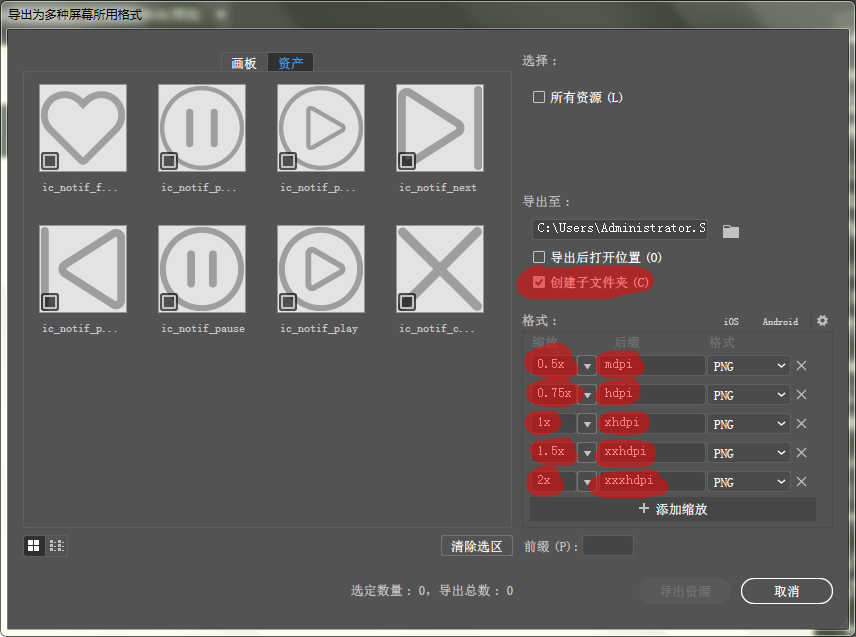
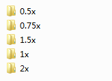

# 使用说明

> **要求 `Python 3.x`**

**功能**：复制导出的图片资源到 `Android` 的资源目录中。

**执行脚本:**

```txt
python copy.py [config_file]
```

**参数说明：**

* **`config_file`**：配置文件。该参数是可选的，如果省略该参数，那么必须在脚本的执行目录下创建一个名为 `'copy_config.json'` 的配置文件。

**配置文件格式:**

```json
{
    "input_dir": "<string>",
    "output_dir": "<string>",
    "dir_maps": "<map>"
}
```

**字段说明：**

* **`input_dir`**：输入目录，字符串类型。
* **`output_dir`**：输出目录，字符串类型。
* **`dir_maps`**：目录映射，对象类型。每个 `key` 都表示 `input_dir` 的一个子目录，`value` 都表示 `output_dir` 下的一个子目录。`key` 目录下的所有文件都会被复制到其 `value` 值对应的目录下。

**例：**

```json
{
    "input_dir": "C:/test/input_dir",
    "output_dir": "C:/my_android/app/src/main/res",
    "dir_maps": {
        "0.5x": "mipmap-mdpi",
        "0.75x": "mipmap-hdpi",
        "1x": "mipmap-xhdpi",
        "1.75x": "mipmap-xxhdpi",
        "2x": "mipmap-xxxhdpi"
    }
}
```

上例中，`input_dir` 下的 `0.5x` 目录中的所有文件都会被复制到 `output_dir` 目录下的 `mipmap-mdpi` 目录中（如果这个目录不存在，则会创建这个目录）；同理，`0.75x` 目录中的所有文件都会被复制到 `output_dir` 目录下的 `mipmap-hdpi` 目录中（如果这个目录不存在，则会创建这个目录），其他 `dir_maps` 字段依次类推。

## 使用步骤

这里以 `Adobe Illustrator` 为例来说明使用步骤。

**1. 导出设置：**

首先是设置 `Illustrator` 的导出设置，导出时请勾选 **`"创建子文件夹"`**，如下图所示：



导出后的目录结构如下图所示：



**2. 编写配置文件：**

* 在任意目录下创建一个配置文件（文件名任意，例如 `copy_config.json`）；
* 将配置文件的 `"input_dir"` 字段设为 `Illustrator` 的导出目录；
* 将配置文件的 `"output_dir"` 字段设为 `Android` 模块的 `res` 目录；
* 根据 `Illustrator` 的导出设置编写 `"dir_maps"` 字段。根据上图中的导出设置，`"dir_maps"` 字段的值应该为：

```json
"dir_maps": {
    "0.5x": "mipmap-mdpi",
    "0.75x": "mipmap-hdpi",
    "1x": "mipmap-xhdpi",
    "1.75x": "mipmap-xxhdpi",
    "2x": "mipmap-xxxhdpi"
}
```

编写完配置文件后运行以下命令即可完成资源的复制：

```txt
python copy.py <config_file>
```

其中，`<config_fil>` 是配置文件的名称。
